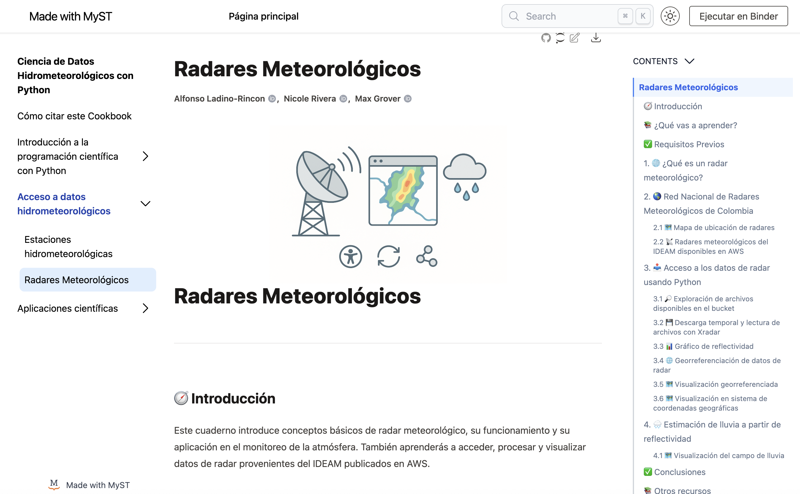
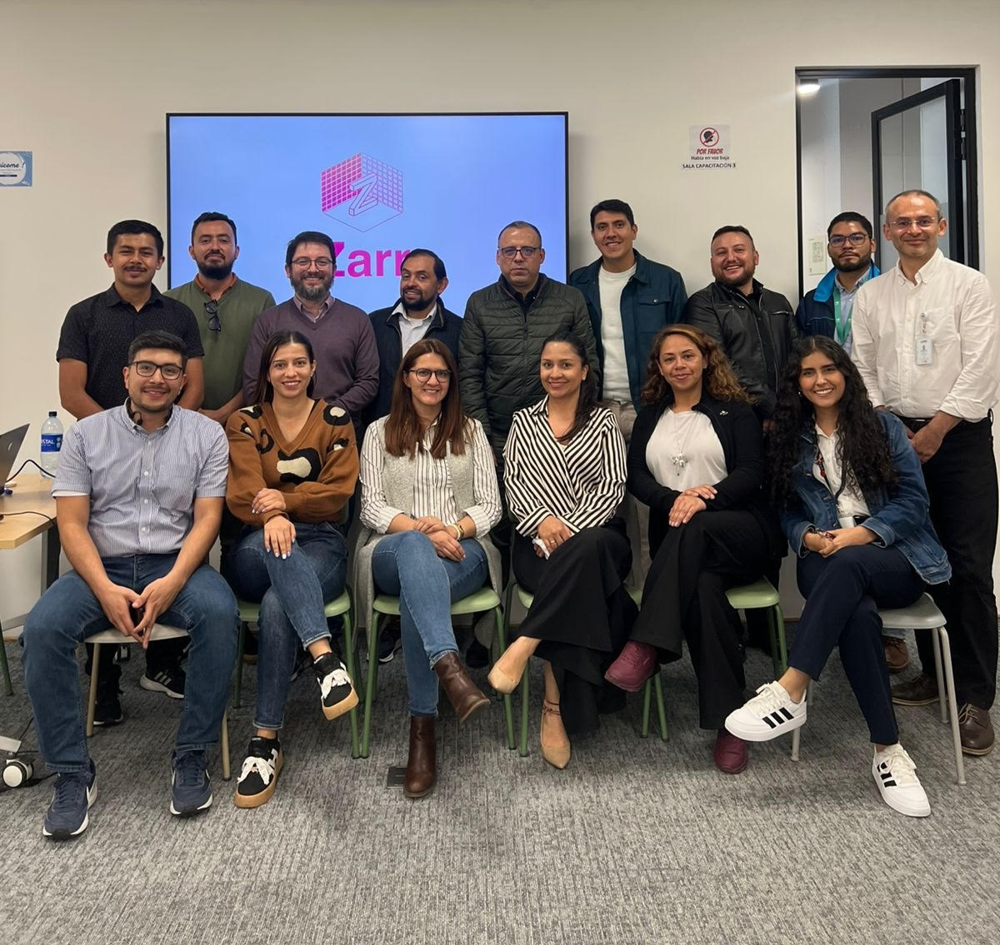

El crecimiento acelerado de datos generados por redes de radar meteorológico, por los modelos numéricos de pronóstico, y por los modelos hidrológicos distribuidos plantean un desafío de escala y acceso para la gestión de riesgos de desastres. La dispersión de estos datos en infraestructuras locales de difícil acceso dificulta su aprovechamiento, haciendo necesaria la migración a la nube para garantizar disponibilidad y escalabilidad.

Para un acceso rápido y eficiente en la nube, no basta con trasladar archivos NetCDF, HDF5, o formatos binarios (propietarios) diseñados para entornos locales y que requieren su descarga completa para su procesamiento generando duplicados, elevando costos, y dificultando la reproducibilidad de los análisis. Se requiere superar estas limitaciones que restringen el acceso simultáneo, escalable y eficiente a los datos.

En respuesta a estos desafíos, existen formatos modernos como Zarr, capaces de almacenar grandes volúmenes de datos en la nube de forma nativa. Su organización en fragmentos o "chunks" independientes, que separan metadatos de información, facilita consultas rápidas y acceso selectivo sin necesidad de transferir archivos completos, habilitando acceso tipo "data streaming". Al permitir trabajar directamente sobre pequeños fragmentos, Zarr favorece la escalabilidad del análisis y el procesamiento paralelo eficiente de grandes conjuntos de datos distribuidos.

Para ilustrar las ventajas de este nuevo paradigma de almacenamiento y acceso a datos optimizados para la nube, aplicaremos soluciones basadas en principios de ciencia abierta FAIR al manejo de datos de radares meteorológicos de Colombia y de Estados Unidos (NEXRAD). Utilizando el formato Zarr junto con Xarray y Xradar, desarrollaremos un modelo jerárquico y abierto, adaptado a entornos de almacenamiento de objetos, que permite consultas eficientes, actualizaciones dinámicas y análisis escalables sobre series de tiempo de grandes volúmenes de datos.

Esta implementación demostró mejoras de hasta 210 veces en los tiempos de procesamiento en comparación con enfoques tradicionales, incluso utilizando configuraciones de hardware estándar. Los resultados evidencian el potencial de los formatos cloud-native para transformar la gestión de datos científicos a gran escala, promoviendo su apertura, interoperabilidad y reutilización en áreas críticas como la gestión del riesgo y la investigación climática.

## Información del evento

-   Fecha: Martes 24 de junio, 8:30 am a 12:30 pm

-   Duración: 4 horas

-   Lugar: Avenida Calle 26 No. 92-32 Connecta, Edificio G9, Piso 1, Sala 3

-   Modalidad: Taller teórico práctico presencial, solo por invitación

:::{admonition} Programa del evento
:class: note

-   8:30–8:45: Saludo de bienvenida
-   8:45–9:45: Charla introductoria: Del Dato al Impacto: Zarr y la Nueva Era de Datos Abiertos en la Nube para la Gestión del Riesgo de Desastres
-   9:45–10:00: Pausa
-   10:00–11:00: Acceso a datos con radar usando Python - Introducción a datos ARCO-FAIR
-   11:00–12:00: Ventajas de usar Zarr en datos de radar - Cómputo de Quasi-Vertical Profiles (QVP) - Cómputo de estimados de lluvia (QPE)
-   12:00–12:30: Discusión, conclusiones y pasos a seguir

:::

:::{iframe} https://drive.google.com/file/d/1HO0ssqZaffpgqwvyomJr9IeEV7ROvNzd/preview :width: 100% :::

## Materiales y recursos

-   Cuaderno de Python: **Radares Meteorológicos**. [*Link*](https://aladinor.github.io/AtmosCol-2023/radares)
-   Libro de Python: Ciencia de Datos Hidrometeorológicos con Python. [*Link*](https://aladinor.github.io/AtmosCol-2023/)

## Cierre

{width="250"}